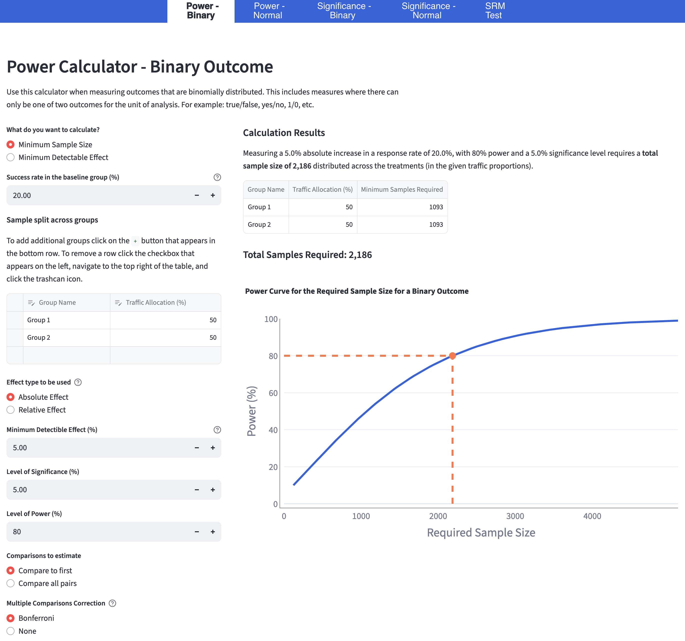

# Experiment Calculator

A statistical toolkit for designing, analysing, and diagnosing A/B tests. This is a Python/Streamlit implementation of the [original R Shiny Experiment Calculator](https://github.com/sabush/ExperimentCalculator) by [Stephen Bush](https://github.com/sabush).

## Overview

Experiment Calculator provides three core statistical calculators for experimenters and data scientists:

1. **[Power Calculator](calculator_types/power_calculator.md)** - Determine required sample sizes or minimum detectable effects for experiment design.
2. **[Significance Calculator](calculator_types/significance_calculator.md)** - Analyse experiment results with confidence intervals and multiple comparison corrections.
3. **[Sample Ratio Mismatch (SRM) Test](calculator_types/srm_calculator.md)** - Identify statistically significant deviations from the expected sample proportions, and diagnose data quality issues in randomised experiments.

All calculators support both **binary outcomes** (conversion rates, click-through rates) and **continuous outcomes** (revenue, time-on-site, engagement metrics, etc.).



_Example: Power calculator for binary outcomes showing sample size requirements and power curve visualisation._

### Key Features

-   ✅ **Statistically rigorous**: Implements standard methods from statsmodels and scipy
-   ✅ **Multiple testing corrections**: Bonferroni correction for family-wise error rate control
-   ✅ **Sequential testing**: O'Brien-Fleming spending function for early stopping
-   ✅ **Flexible designs**: Supports multi-arm experiments with arbitrary traffic allocations
-   ✅ **Interactive visualisations**: Power curves and forest plots with Plotly

## Use Cases

Please click on the header links below for examples of all calculator types and explanations of their contents.

### [Power Calculator](calculator_types/power_calculator.md)

-   **Sample size planning**: "How many users do I need to detect a 5% conversion rate increase?"
-   **Experiment feasibility**: "With 10,000 daily users, what's the smallest effect I can detect?"
-   **Multi-arm testing**: Calculate sample requirements for 3+ treatment groups.

### [Significance Calculator](calculator_types/significance_calculator.md)

-   **Result analysis**: "Is the treatment significantly better than control?"
-   **Effect estimation**: Calculate point estimates and confidence intervals.
-   **Multiple comparisons**: Test multiple treatments while controlling false positive rate.

### [SRM Test](calculator_types/srm_calculator.md)

-   **Data quality**: "Did my randomisation work correctly?"
-   **Early detection**: Catch implementation bugs before analysing results
-   **Debugging**: Identify traffic routing issues in experimentation platforms

## Quick Start

### Installation

#### Option 1: Poetry (Recommended)

```bash
# Clone the repository
git clone https://github.com/a-anderson/Experiment-Calculator.git
cd Experiment-Calculator

# Install dependencies with Poetry
poetry install

# Run the application
poetry run streamlit run streamlit_main.py
```

#### Option 2: pip + venv

```bash
# Clone the repository
git clone https://github.com/a-anderson/Experiment-Calculator.git
cd Experiment-Calculator

# Create and activate virtual environment
python3 -m venv venv
source venv/bin/activate  # On Windows: venv\Scripts\activate

# Install dependencies
python3 -m pip install -r requirements.txt

# Run the application
python3 -m streamlit run streamlit_main.py
```

The app will open in your browser at `http://localhost:8501`

## Documentation

### Power Calculator

Calculate the sample size required to detect a specified effect with desired statistical power, or calculate the minimum detectable effect with a specified sample size.

**Example: Binary Outcome (Conversion Rate)**

```
Baseline conversion rate: 10%
Minimum detectable effect: 2% (absolute) or 20% (relative)
Significance level: 5%
Power: 80%
Traffic split: 50/50

Result: 3,842 samples per group (7,684 total)
```

**Example: Continuous Outcome (Button Clicks Per User)**

```
Baseline mean: 100
Baseline std dev: 50
Minimum detectable effect: 5% (relative)
Significance level: 5%
Power: 80%

Result: 1,571 samples per group (3,142 total)
```

See [calculator_types/power_calculator.md](calculator_types/power_calculator.md) for detailed examples.

### Significance Calculator

Analyse completed experiments with confidence intervals and hypothesis tests.

**Features:**

-   Point estimates and confidence intervals for each group
-   Between-group comparisons with statistical significance tests
-   Forest plots for visual comparison
-   Multiple testing corrections (Bonferroni)
-   Sequential testing corrections (O'Brien-Fleming)

See [calculator_types/significance_calculator.md](calculator_types/significance_calculator.md) for examples.

### Sample Ratio Mismatch Test

Detect deviations from expected sample proportions using chi-square goodness-of-fit test.

**When to use:**

-   Before analysing experiment results
-   If results seem "too good to be true"
-   To validate randomisation implementation

See [calculator_types/srm_calculator.md](calculator_types/srm_calculator.md) for details.

## Architecture

### Project Structure

```
Experiment-Calculator/
├── experiment_calculator/          # Main application package
│   ├── core/                       # Statistical logic
│   │   ├── calculations.py           # Statistical computations
│   │   ├── validation.py             # Input validation
│   │   └── types.py                  # Type definitions
│   ├── ui/                         # User interface components
│   │   ├── components.py
│   │   └── plots.py
│   ├── pages/                      # Streamlit pages
│   │   ├── power.py
│   │   ├── significance.py
│   └── └── srm_test.py
├── tests/                          # Test suite
│   ├── unit/                       # Unit tests for core functions
│   │   ├── test_calculations.py
│   │   ├── test_validation.py
│   │   └── test_edge_cases.py
│   ├── integration/                # Integration & workflow tests
│   │   ├── test_power_flows.py
│   │   ├── test_significance_flows.py
│   │   └── test_cross_validation.py
├── calculator_types/               # Documentation
├── streamlit_main.py               # Application entry point
├── pyproject.toml                  # Project configuration
└── README.md
```

## Testing

### Running Tests

```bash
# Run all tests with coverage
poetry run pytest tests/ -v --cov=experiment_calculator --cov-report=html

# Run only unit tests (fast)
poetry run pytest tests/unit/ -v

# Run only integration tests
poetry run pytest tests/integration/ -v
```

## Statistical Methods

### Power Analysis

-   **Effect size calculations**: Cohen's d for continuous outcomes, proportion differences for binary
-   **Sample size**: Two-sample t-test power calculation (statsmodels `tt_ind_solve_power`)
-   **Unequal allocation**: Supports arbitrary traffic splits between groups

### Confidence Intervals

-   **Binary outcomes**: Normal approximation with continuity correction
-   **Continuous outcomes**: Welch's t-test (unequal variances assumed)
-   **Relative effects**: Delta method for standard error estimation

### Multiple Testing

-   **Bonferroni correction**: Conservative family-wise error rate control
-   **Comparison types**: Compare all to control, or all pairwise comparisons

### Sequential Testing

-   **O'Brien-Fleming**: Alpha spending function for interim analyses
-   **Information fraction**: Proportion of planned experiment duration completed

### Sample Ratio Mismatch

-   **Chi-square test**: Goodness-of-fit test for observed vs. expected proportions
-   **Threshold**: Default p-value threshold of 0.001 (Kohavi et al., 2012)

## License

This project is licensed under the MIT License - see the [LICENSE](LICENSE) file for details.

## Acknowledgments

-   Original calculator concept by [Stephen Bush](https://github.com/sabush)
-   SRM Test icons by Iconjam from [www.flaticon.com](http://www.flaticon.com)

## Contact

**Author:** Ashley Anderson

-   GitHub: [@a-anderson](https://github.com/a-anderson)
-   LinkedIn: [www.linkedin.com/in/a-anderson](https://www.linkedin.com/in/a-anderson/)
