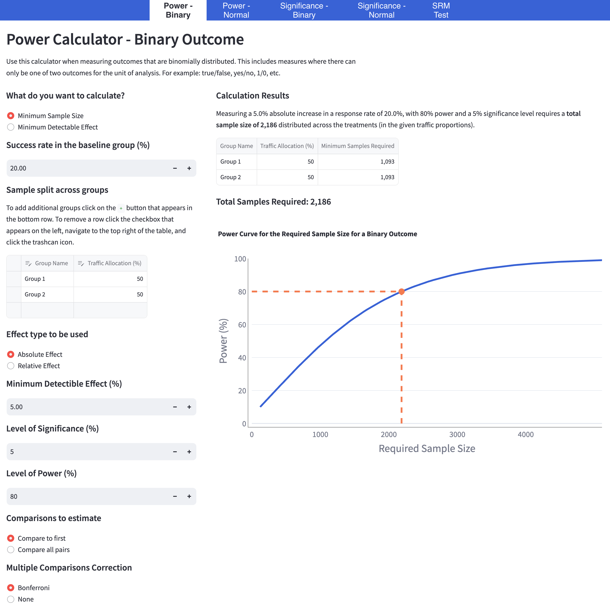
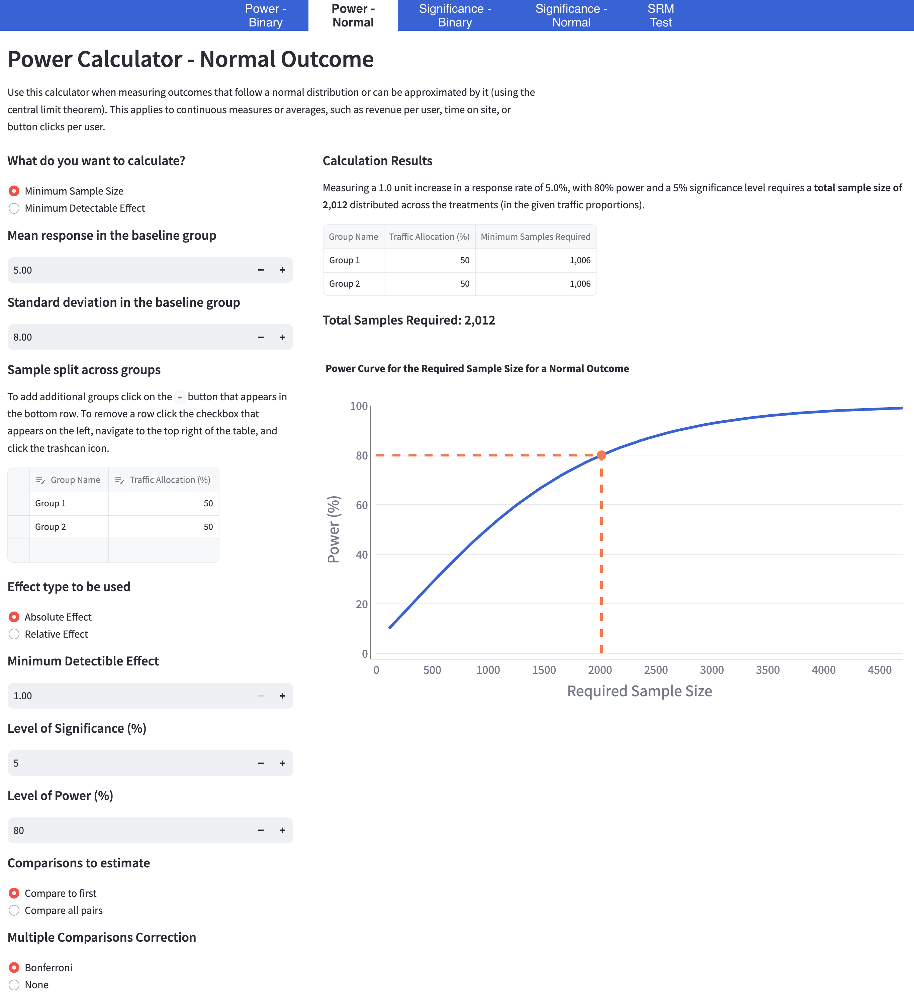

# Power Calculator

## Inputs for both outcome types

-   **Sample Size**: Calculates how many units are needed to detect the specified effect size.
-   **Minimum Detectable Effect**: Smallest effect size the test aims to detect (e.g., 5%).
-   **Sample Split**: Percentage of traffic assigned to each group (e.g., 50/50).
-   **Effect Type**: Absolute/relative effect detects a specific increase from the baseline group (e.g., 5%).
-   **Significance Level**: Risk of a false positives (type I error rate, e.g. 5%).
-   **Power Level**: Probability of detecting a significant effect if a true effect exists (e.g., 80%).
-   **Comparison Type**: Which groups to compare for the experiment.
-   **Multiple Comparisons Correction**: [Bonferroni](https://en.wikipedia.org/wiki/Bonferroni_correction) adjustment to correct the significance level when [comparing mulitple groups](https://en.wikipedia.org/wiki/Multiple_comparisons_problem).
-   **Power Curve**: Visualises the sample size requred to reach the specified experimental power (e.g., 2,186 units).

## Power calculator for binary outcomes

-   **Baseline Success Rate**: Conversion rate for the baseline group (e.g., 20%). Used as an estimate for the expected success rate in the experiment control group.

## Power calculator for normally distributed outcomes

-   **Baseline Mean Response**: Absolute mean for the baseline group (e.g., 5.0 units). Used as an estimate for the expected mean in the experiment control group.
-   **Baseline Standard Deviation**: Standard deviation for the baseline group. Used as an estimate for the expected standard deviation in the experiment control group.

