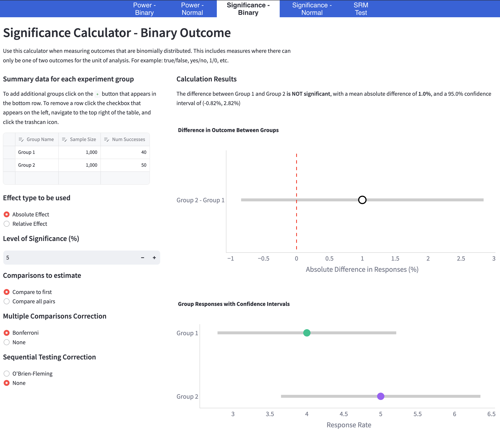
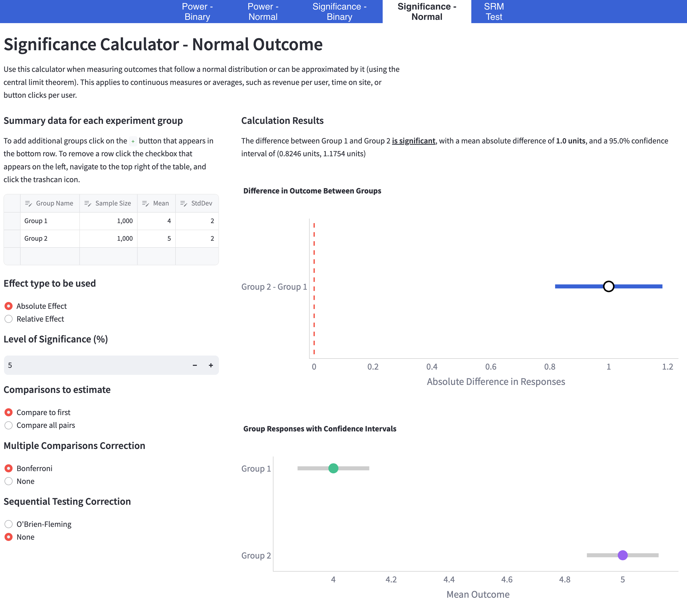

# Significance Calculator

## Inputs for both outcome types

-   **Experiment Summary Data**: Summary statistics for the experiment that has been conducted.
-   **Minimum Detectable Effect**: Smallest effect size the test aims to detect (e.g., 5%).
-   **Effect Type**: Absolute/relative effect detects a specific increase from the baseline group (e.g., 5%).
-   **Significance Level**: Risk of a false positives (type I error rate, e.g. 5%).
-   **Power Level**: Probability of detecting a significant effect if a true effect exists (e.g., 80%).
-   **Comparison Type**: Which groups to compare for the experiment.
-   **Multiple Comparisons Correction**: [Bonferroni](https://en.wikipedia.org/wiki/Bonferroni_correction) adjustment to correct the significance level when [comparing mulitple groups](https://en.wikipedia.org/wiki/Multiple_comparisons_problem).
-   **Sequential Testing Correction**: [O'Brien-Fleming](https://online.stat.psu.edu/stat509/lesson/9/9.5) correction to account for peeking in sequential testing.
-   **Group Difference Plot**: Visualises the group difference results for the experiment.
-   **Group Response Plot**: Visualises the experiment responses for each individual group.

## Example significance calculator for binary outcomes

## Example significance calculator for normally distributed outcomes

