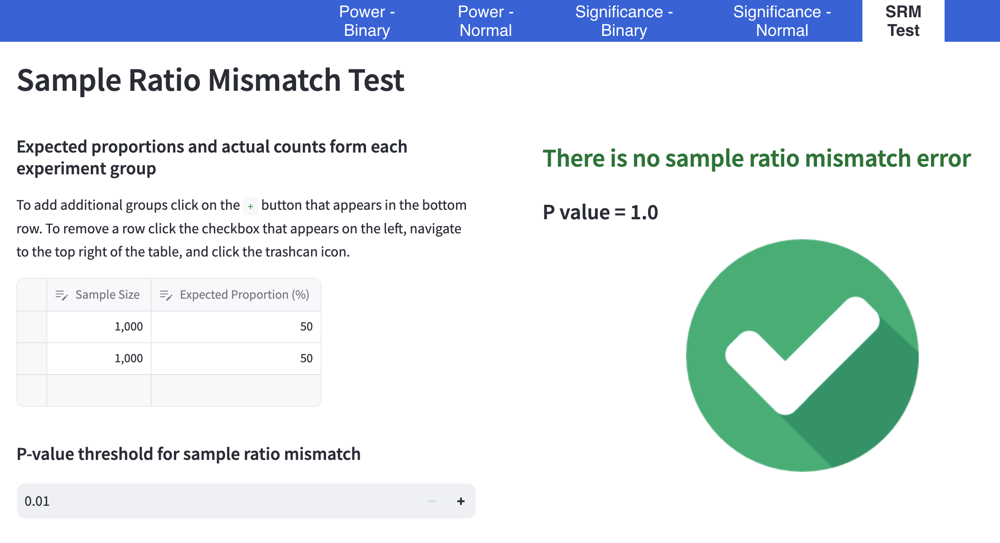
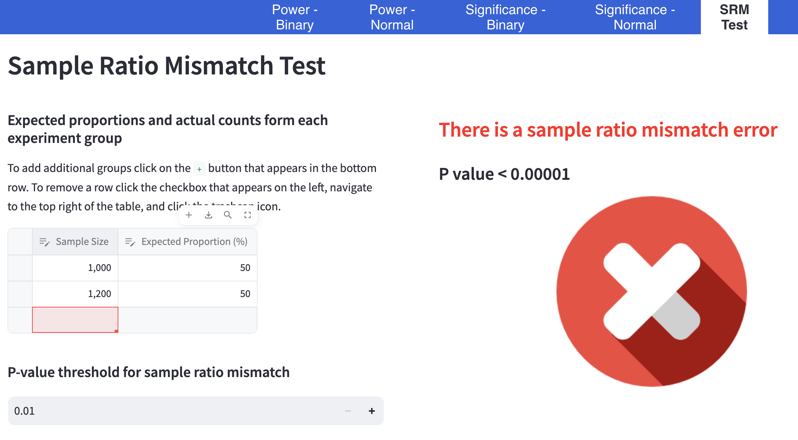

# Sample Ratio Mismatch Calculator

## Inputs for both outcome types

-   **Experiment Summary Data**: Sample sizes and expected proportions for each group in the experiment that has been conducted.
-   **P-value Threshold**: The threshold to use for the p-value to determine if the sample ratio is statically significantly mismatched. The recommended default is `p = 0.001` (1% threshold).

## Sample ratio mismatch calculator

#### No mismatch

#### Significant mismatch

